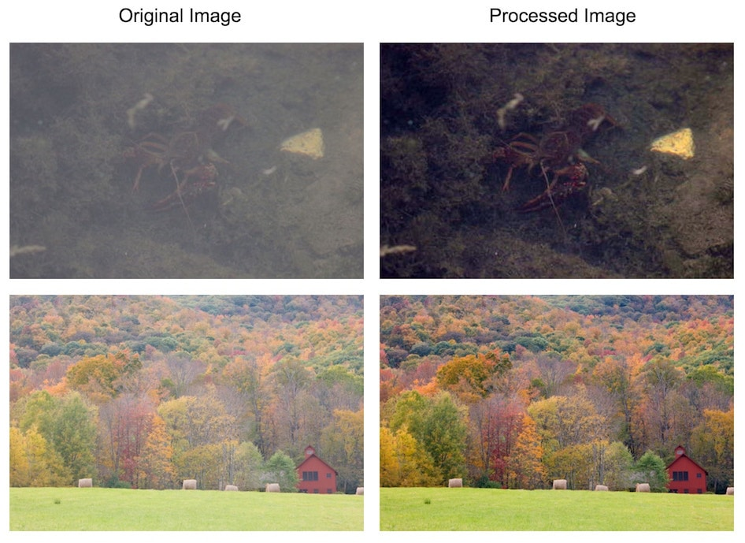

#cla*
**[download](http://alpercinar.com/cla/cla.min.js)** ,
**[github](https://github.com/alperr/cla)** , 
**[demo](http://alpercinar.com/cla/demo.html)**

**color-level-adjuster*

_cla_ is a small javascript image processing library for applying an automatic color level adjustment to an image at the client side . _cla_ may improve the tonal quality of the image ( especially photos with low color range )

Library contains a single function named __adjustColorLevel__ in a single javascript file . Library is also available as a typescript file . 

__adjustColorLevel__ function takes 2 parameters

- first parameter is an [HTMLImageElement](https://developer.mozilla.org/en/docs/Web/API/HTMLImageElement)
- second parameter is the callback function that is called after raw image is downloaded & processed . Callback arguments are 
	- processedImage as an HTMLImageElement 
	- modificationRate as a number . 

_sample usage_

	var rawImage = new Image();
	rawImage.src = 'sample.jpg';

	// you can also select your  tag and assign to rawImage , example :
	// rawImage = document.getElementById('your-image-id');

	adjustColorLevel(rawImage , imageProcessHandler);
		
	function imageProcessHandler(processedImage , modificationRate)
	{
		document.body.appendChild(rawImage);
		document.body.appendChild(processedImage);
	}

modificationRate is a number ranging between 0-100 which shows the amount of modification that the image processing has done . Having the modificationRate equals to 0 means that , raw image already has a high color range and processing did not change anything .

Image source of the processedImage is encoded as base64 string .

##Examples

###Security Restrictions

This library uses HTML5 Canvas API . In order to read data from canvas , drawn images must be in the same domain with the html file or image must have a [CORS](https://developer.mozilla.org/en-US/docs/Web/HTTP/Access_control_CORS) header . 

